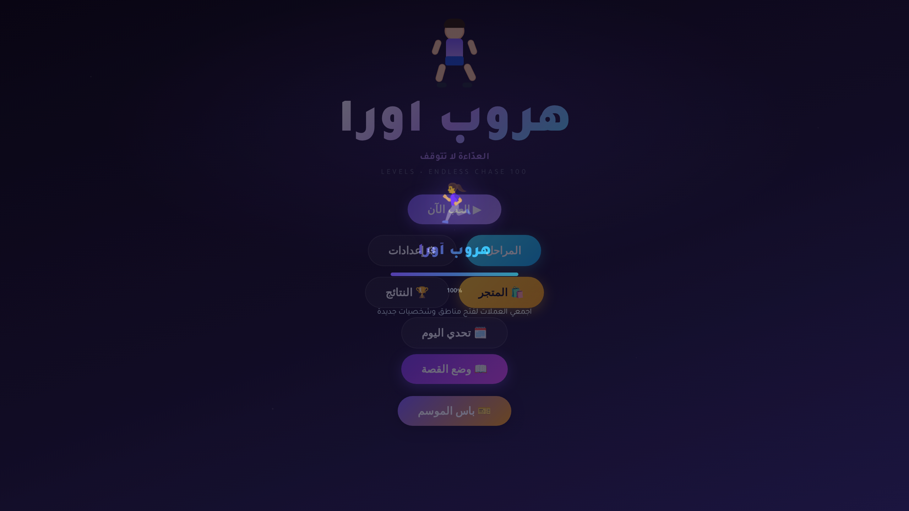

<div align="center">

# 🏃‍♀️ هروب أورا | Aura's Escape

**لعبة عدّاءة لا نهائية مبنية بـ HTML5 Canvas مع قصة ومتاجر وتحديات يومية**  
**Endless runner game built with HTML5 Canvas featuring story mode, shop system & daily challenges**

[](https://developer.mozilla.org/en-US/docs/Web/HTML)
[](https://developer.mozilla.org/en-US/docs/Web/CSS)
[](https://developer.mozilla.org/en-US/docs/Web/JavaScript)
[](https://developer.mozilla.org/en-US/docs/Web/API/Canvas_API)
[](https://web.dev/progressive-web-apps/)
[](https://aura-escape.vercel.app/)
[](https://github.com/ziadamr45/AuraEscape)

🔗 **[aura-escape.vercel.app](https://aura-escape.vercel.app/)**

</div>

---

## 🇸🇦 بالعربية

### 📖 نبذة عن اللعبة

**هروب أورا** هي لعبة عدّاءة لا نهائية مبنية بالكامل بتقنيات الويب الأساسية HTML5 و CSS3 و JavaScript باستخدام Canvas API للرسومات. تتبع اللعبة بطلة اسمها "أورا" التي تهرب عبر عوالم مختلفة مليئة بالعقبات والمطاردات والألغاز. تتميز اللعبة بنظام قصة تفاعلية مع فصول قابلة للفت، متجر شامل لشراء الشخصيات والمركبات والقدرات، تحديات يومية وأسبوعية، نظام باس الموسم، وزعيم لوحة المتصدرين. اللعبة تدعم العربية والإنجليزية بالكامل مع تصميم متجاوب يعمل على جميع الأجهزة.

### ✨ المميزات الرئيسية

- 🏃‍♀️ **لعبة عدّاءة لا نهائية** — نظام لعب سلس مع تحكم بالسحب والنقر، 3 حارات، قفز وانزلاق وتغيير الحارة
- 🎮 **20 منطقة و80+ مرحلة** — مناطق متنوعة بتصاميم وموسيقى مختلفة، كل منطقة بألوان وأجواء فريدة
- 📖 **نظام القصة** — فصول قصة تفاعلية تُفتح تدريجياً مع تقدم اللاعب في المراحل
- 🛍️ **المتجر الشامل** — شراء شخصيات ومركبات وقدرات وعناصر تجميلية بعملات اللعبة
- 🤺 **نظام المطاردة** — مطاردون بأذكية مختلفة يلاحقون اللاعب ويضيفون تحدي إضافي
- 👹 **معارك الزعماء** — مواجهات ملحمية مع زعماء أقوياء في نهايات المناطق
- 🎫 **باس الموسم** — نظام معركة مع مستويات ومكافآت حصرية
- 🗓️ **تحديات يومية وأسبوعية** — مهام متجددة بمكافآت مميزة
- 🏆 **لوحة المتصدرين** — تنافس على أعلى المراكز عالمياً
- 💰 **مكافآت يومية** — نظام تسلسلي لمكافآت الدخول اليومي
- 🧙 **شخصيات متعددة** — كل شخصية بقدرات وإحصائيات فريدة
- 🚀 **مركبات متنوعة** — دراجات وسيارات ومركبات فضائية بسرعات مختلفة
- ⚡ **نظام القدرات** — 4 قدرات قابلة للتفعيل مع أوقات انتظار
- 🔥 **نظام الكومبو** — سلاسل حركات متتالية تضاعف النقاط
- 🌐 **ثنائي اللغة** — دعم كامل للعربية (RTL) والإنجليزية (LTR)
- 📱 **PWA** — يعمل كتطبيق ويب تقدمي مع دعم العمل بدون إنترنت
- 🎨 **تأثيرات بصرية متقدمة** — اهتزاز الشاشة، حركة بطيئة، أثر الحركة، ومطر العملات
- ♿ **إمكانية الوصول** — خيارات تباين عالي ووضع عمى الألوان
- ⚙️ **إعدادات شاملة** — صوت، اهتزاز، جودة الرسومات، حساسية السحب

### 🛠️ التقنيات المستخدمة

| التقنية | الاستخدام |
|---------|-----------|
|  | هيكل الصفحة وبنية اللعبة |
|  | التصميم والأنماط والتأثيرات والحركات |
|  | محرك اللعبة والمنطق البرمجي والتفاعلية |
|  | رسم الرسومات والمؤثرات البصرية |
|  | تطبيق ويب تقدمي ودعم العمل بدون إنترنت |
|  | التخزين المؤقت والعمل بدون اتصال |
|  | الخطوط (Tajawal + Nunito) |

### 📁 هيكل المشروع

```
AuraEscape/
├── index.html          # الملف الوحيد - يحتوي على كل شيء
│   ├── HTML             # بنية الواجهة والشاشات
│   ├── CSS              # الأنماط والتأثيرات (مضمّن)
│   ├── JavaScript       # محرك اللعبة الكامل (مضمّن)
│   └── Service Worker   # دعم العمل بدون إنترنت (مضمّن)
└── README.md           # هذا الملف
```

### 🚀 طريقة التشغيل

1. قم باستنساخ المستودع:
   ```bash
   git clone https://github.com/ziadamr45/AuraEscape.git
   ```
2. افتح ملف `index.html` في المتصفح مباشرة
3. أو استخدم أي خادم محلي مثل Live Server

### 📸 لقطات الشاشة | Screenshots



### 🔮 تحسينات مستقبلية

- إضافة المزيد من المناطق والمراحل
- نظام إنجازات وميداليات
- وضع متعدد اللاعبين
- تحسين المؤثرات الصوتية
- دعم لغات إضافية
- نظام أحداث موسمية

### 👨‍💻 المطور

**زياد عمرو (Ziad Amr)**

- 📱 Telegram: [@ziadamr](https://t.me/ziadamr)
- 📘 Facebook: [ziad7mr](https://www.facebook.com/ziad7mr)
- 🎥 YouTube: [@alhayat_ala_eltareek](https://youtube.com/@alhayat_ala_eltareek)
- 🌐 الموقع الشخصي: [ziadamrme.vercel.app](https://ziadamrme.vercel.app)

### 📜 الرخصة

⚠️ رخصة عرض المصدر — هذا المشروع متاح **للعرض والاطلاع فقط**. لا يمكن نسخ الكود أو إعادة إنتاجه أو استخدامه في مشاريع أخرى.

---

## 🇺🇸 In English

### 📖 About the Game

**Aura's Escape** is an endless runner game built entirely with core web technologies — HTML5, CSS3, and JavaScript — using the Canvas API for rendering. The game follows a heroine named "Aura" as she escapes through different worlds filled with obstacles, chasers, and puzzles. It features an interactive story system with unlockable chapters, a comprehensive shop for purchasing characters, vehicles, and abilities, daily and weekly challenges, a season pass system, and a leaderboard. The game fully supports Arabic and English with a responsive design that works on all devices.

### ✨ Key Features

- 🏃‍♀️ **Endless Runner** — Smooth gameplay with swipe and tap controls, 3 lanes, jump, slide, and lane switching
- 🎮 **20 Zones & 80+ Levels** — Diverse zones with unique designs and music, each zone with its own colors and atmosphere
- 📖 **Story Mode** — Interactive story chapters that unlock progressively as the player advances through levels
- 🛍️ **Comprehensive Shop** — Purchase characters, vehicles, abilities, and cosmetic items with in-game coins
- 🤺 **Chaser System** — Intelligent chasers with different AI behaviors that pursue the player for added challenge
- 👹 **Boss Battles** — Epic encounters with powerful bosses at the end of zones
- 🎫 **Season Pass** — Battle pass system with levels and exclusive rewards
- 🗓️ **Daily & Weekly Challenges** — Refreshing missions with special rewards
- 🏆 **Leaderboard** — Compete for top ranks globally
- 💰 **Daily Rewards** — Sequential login reward system
- 🧙 **Multiple Characters** — Each character with unique abilities and stats
- 🚀 **Various Vehicles** — Bikes, cars, and spacecraft with different speeds
- ⚡ **Ability System** — 4 activatable abilities with cooldowns
- 🔥 **Combo System** — Chain consecutive moves to multiply points
- 🌐 **Bilingual** — Full Arabic (RTL) and English (LTR) support
- 📱 **PWA** — Works as a Progressive Web App with offline support
- 🎨 **Advanced Visual Effects** — Screen shake, slow motion, motion trails, and coin rain
- ♿ **Accessibility** — High contrast and colorblind mode options
- ⚙️ **Comprehensive Settings** — Sound, vibration, graphics quality, swipe sensitivity

### 🛠️ Technologies Used

| Technology | Purpose |
|------------|---------|
|  | Page structure and game layout |
|  | Styling, animations, and visual effects |
|  | Game engine, logic, and interactivity |
|  | Rendering graphics and visual effects |
|  | Progressive Web App & offline support |
|  | Caching and offline functionality |
|  | Fonts (Tajawal + Nunito) |

### 📁 Project Structure

```
AuraEscape/
├── index.html          # Single file — contains everything
│   ├── HTML             # UI structure and screens
│   ├── CSS              # Styles and effects (embedded)
│   ├── JavaScript       # Complete game engine (embedded)
│   └── Service Worker   # Offline support (embedded)
└── README.md           # This file
```

### 🚀 How to Run

1. Clone the repository:
   ```bash
   git clone https://github.com/ziadamr45/AuraEscape.git
   ```
2. Open `index.html` in your browser directly
3. Or use any local server like Live Server

### 📸 Screenshots


### 🔮 Future Improvements

- Add more zones and levels
- Achievements and medals system
- Multiplayer mode
- Enhanced sound effects
- Additional language support
- Seasonal events system

### 👨‍💻 Developer

**Ziad Amr**

- 📱 Telegram: [@ziadamr](https://t.me/ziadamr)
- 📘 Facebook: [ziad7mr](https://www.facebook.com/ziad7mr)
- 🎥 YouTube: [@alhayat_ala_eltareek](https://youtube.com/@alhayat_ala_eltareek)
- 🌐 Portfolio: [ziadamrme.vercel.app](https://ziadamrme.vercel.app)

### 📜 License

⚠️ Source Available License — This project is available for **viewing and reference only**. The code cannot be copied, reproduced, or used in other projects.

---

<div align="center">

Made with ❤️ by [Ziad Amr](https://github.com/ziadamr45)

</div>
